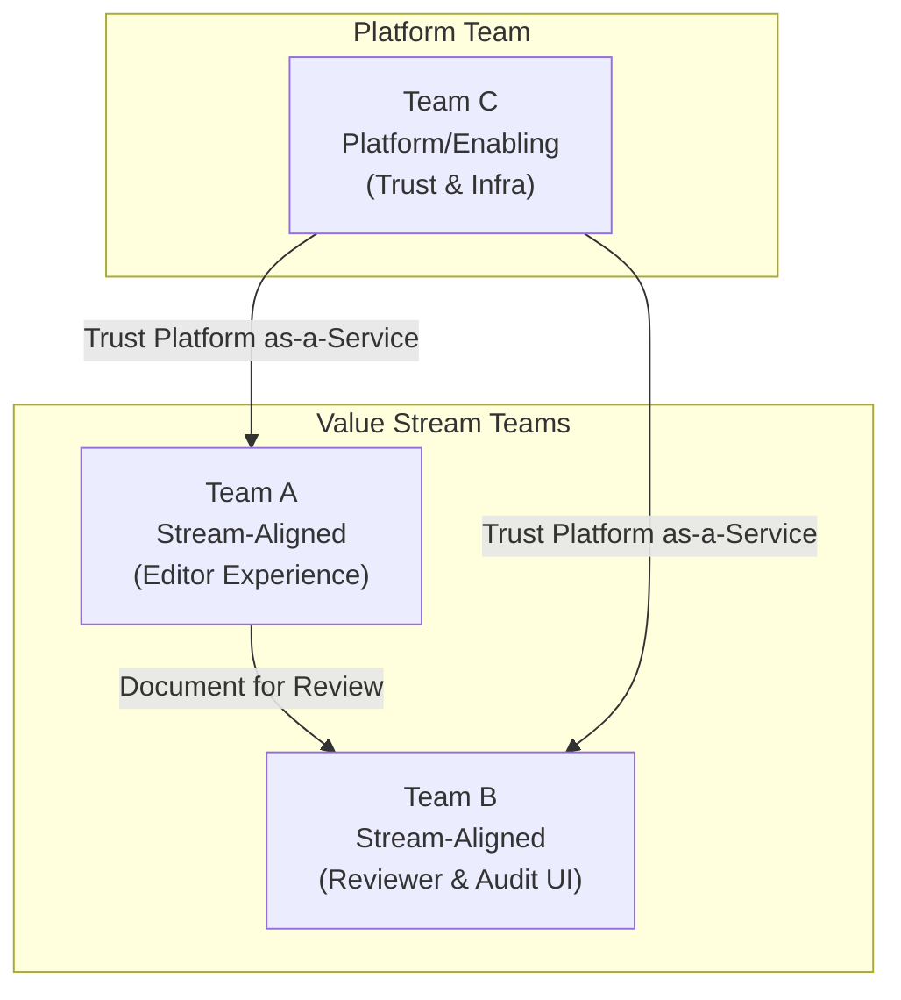

# PaperTrail Architecture

## 1. Team Topology & Ownership Model

Here is the high-level map of our team interactions. The system's architecture should be a reflection of this structure.

### Team Inventory

| Team Name | Type | Responsibilities | Current Headcount | Key Skills |
|-----------|------|-----------------|-------------------|------------|
|           |      |                 |                   |            |

### Team Interaction Modes

| Team A | Team B | Interaction Mode | Notes |
|--------|--------|-----------------|-------|
|        |        |                 |       |

*Interaction modes: Collaboration, X-as-a-Service, Facilitating*

### Cognitive Load Assessment

| Team | Services Owned | Cognitive Load (Low/Med/High) | Risk |
|------|---------------|-------------------------------|------|
|      |               |                               |      |

## 2. System Context

### Users & Actors
- Internal consultants (500)
- Client users (2,000 across 30 organisations)
- Peak usage: end of fiscal quarters

### External Systems & Integrations
- Existing SharePoint (migration source)
- Client Active Directory instances
- *(others TBD)*

### Client Isolation Boundaries
*(To be defined based on team ownership model)*

---

## 3. Service Boundaries (Mapped to Teams)

| Service | Owning Team | Responsibility | Interaction Mode with Other Services |
|---------|-------------|---------------|--------------------------------------|
| | | | |

*Principle: No service exists without a named owning team that can carry its cognitive load.*

---

## 4. Key Architectural Decisions (ADRs)

### ADR-001: *TBD*
- **Context (team/org):**
- **Decision:**
- **Consequences:**

*(Additional ADRs to follow)*

---

## 5. Data Residency & Compliance

### Regulatory Requirements
- FDA 21 CFR Part 11 (electronic signatures)
- SOX compliance
- EU data residency (documents must never leave the EU)

### Tamper-Proof Audit Trail Design
*(TBD)*

### Electronic Signature Approach
*(TBD)*

---

## 6. Migration Strategy

### Principles
- Incremental migration from SharePoint (no big bang)
- Each phase owned by a named team

### Migration Phases

| Phase | Scope | Owning Team | Dependencies |
|-------|-------|-------------|-------------|
| | | | |

---

## 7. Risks & Blind Spots

### Organisational Risks

| Risk | Impact | Mitigation |
|------|--------|------------|
| | | |

### Technical Risks

| Risk | Impact | Mitigation |
|------|--------|------------|
| | | |