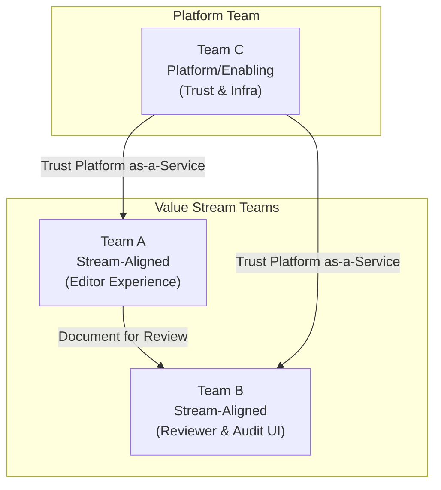

## 1. Team Topology & Ownership Model

Here is the high-level map of our team interactions. The system's architecture should be a reflection of this structure.

### Team Inventory

| Team Name | Type | Responsibilities | Current Headcount | Key Skills |
|-----------|------|-----------------|-------------------|------------|
|           |      |                 |                   |            |

### Team Interaction Modes

| Team A | Team B | Interaction Mode | Notes |
|--------|--------|-----------------|-------|
|        |        |                 |       |

*Interaction modes: Collaboration, X-as-a-Service, Facilitating*

### Cognitive Load Assessment

| Team | Services Owned | Cognitive Load (Low/Med/High) | Risk |
|------|---------------|-------------------------------|------|
|      |               |                               |      |

---
